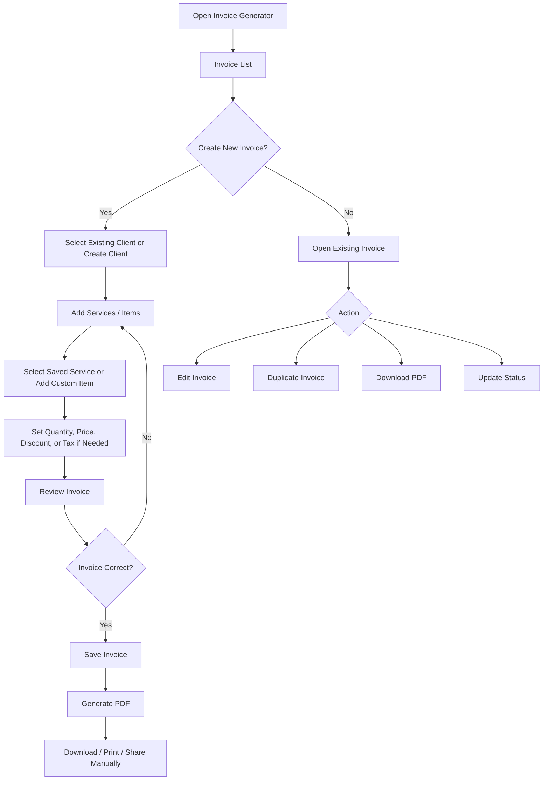

# Product Requirements Document
## Simple Invoice Generator

### 1. Product Overview

The Invoice Generator is a simple internal web application for a small development team to create, manage, and export professional invoices.

The main goal is to make invoice creation fast and repetitive tasks minimal.

Information that rarely changes, such as company information, client information, services, payment details, terms, and invoice notes, should be saved once and reused when creating future invoices.

The application should remain simple, flexible, and easy to maintain. It should not become a full accounting, ERP, CRM, or project management system.

---

# 2. Goals

The application should allow users to:

- Create invoices quickly.
- Avoid rewriting repeated information.
- Save frequently used client information.
- Save frequently used services and prices.
- Automatically calculate invoice totals.
- Duplicate previous invoices.
- Customize individual invoices when necessary.
- Track basic invoice status.
- Export invoices as PDF.
- Maintain a simple history of generated invoices.

---

# 3. Non-Goals

The first version should NOT include:

- Full accounting functionality.
- Expense tracking.
- Payroll.
- Inventory management.
- Complex user roles and permissions.
- Automatic bank reconciliation.
- Payment gateway integration.
- Client portal.
- Automated email delivery.
- Recurring invoice automation.
- Advanced tax compliance systems.
- Complex financial reporting.
- Project management features.

These features may be considered later if they become necessary.

---

# 4. Main User Flow



---

# 5. Application Structure

The application only requires five main areas:

1. Dashboard
2. Invoices
3. Clients
4. Services
5. Settings

The navigation should remain simple and visible.

---

# 6. Dashboard

The Dashboard provides a quick overview of invoice activity.

### Information

Display:

- Total invoices
- Draft invoices
- Sent invoices
- Paid invoices
- Unpaid invoices
- Total invoiced amount
- Total paid amount

The dashboard does not need complex financial analytics.

### Recent Invoices

Display the most recently created or updated invoices.

Columns:

| Field | Description |
|---|---|
| Invoice Number | Invoice identifier |
| Client | Client name |
| Date | Invoice date |
| Due Date | Payment deadline |
| Total | Invoice amount |
| Status | Current invoice status |
| Action | View invoice |

---

# 7. Invoice List

The Invoice page is the main working area.

### Invoice Table

Display:

| Field | Description |
|---|---|
| Invoice Number | Unique invoice number |
| Client | Client name |
| Invoice Date | Date invoice was issued |
| Due Date | Payment due date |
| Total | Final invoice value |
| Status | Draft, Sent, Paid, or Cancelled |
| Actions | View, Edit, Duplicate, PDF |

### Search

Allow searching by:

- Invoice number
- Client name

### Filters

Allow filtering by:

- Status
- Client
- Invoice date

Avoid complex filtering.

---

# 8. Create Invoice

Creating an invoice should be designed around reusable information.

## 8.1 Invoice Information

Fields:

| Field | Requirement |
|---|---|
| Invoice Number | Automatically generated but editable |
| Invoice Date | Default to current date |
| Due Date | Automatically calculated from payment terms but editable |
| Client | Select from saved clients |
| Currency | Default from Settings but editable |

Example invoice numbering:

`INV-2026-001`

The exact numbering format should be configurable in Settings.

---

# 9. Client Selection

Users should not need to rewrite client information for every invoice.

The user selects an existing client.

After selection, the system automatically fills:

- Client name
- Company name
- Email
- Phone
- Address
- Tax information, if available

The information should be copied into the invoice so that historical invoices remain unchanged even if the Client Master data is updated later.

The user can still edit the information for the current invoice without changing the saved client information.

Provide:

**+ Add New Client**

The user should be able to create a new client without leaving the invoice creation process.

---

# 10. Invoice Items

Each invoice contains one or more invoice items.

### Fields

| Field | Description |
|---|---|
| Description | Service or item description |
| Quantity | Number of units |
| Unit | Optional unit such as project, hour, day, or item |
| Unit Price | Price per unit |
| Amount | Quantity × Unit Price |

Example:

| Description | Qty | Unit | Unit Price | Amount |
|---|---:|---|---:|---:|
| Website Development | 1 | Project | Rp 5,000,000 | Rp 5,000,000 |
| Maintenance | 2 | Month | Rp 500,000 | Rp 1,000,000 |

Users should be able to reorder or remove items.

---

# 11. Saved Services

Frequently used services should be stored so users do not repeatedly type the same information.

Examples:

- Website Development
- UI/UX Design
- API Development
- Monthly Maintenance
- Hosting
- Domain
- Technical Support
- Development Hour

Each service can contain:

| Field | Description |
|---|---|
| Service Name | Internal service name |
| Description | Default invoice description |
| Default Price | Default selling price |
| Unit | Project, hour, day, month, etc. |

When creating an invoice, users can select a saved service.

The system automatically fills its description, unit, and price.

All values remain editable on the invoice.

Changing the value on an invoice should not change the saved service.

---

# 12. Custom Invoice Item

Not every invoice item needs to exist in Saved Services.

Provide:

**+ Add Custom Item**

The user can manually enter:

- Description
- Quantity
- Unit
- Price

This keeps the invoice system flexible without requiring every possible service to be registered first.

---

# 13. Calculation

The system should automatically calculate:

```text
Item Amount = Quantity × Unit Price

Subtotal = Sum of Item Amounts

Final Total = Subtotal - Discount + Tax
```

### Optional Discount

Discount should be optional.

Support:

- Percentage
- Fixed amount

Example:

```text
Discount: 10%
```

or

```text
Discount: Rp 500,000
```

---

# 14. Tax

Tax should be optional.

Allow:

- No tax
- Percentage-based tax

Example:

```text
Tax: 11%
```

The default tax value may be configured in Settings.

Users should be able to override it for individual invoices.

No advanced taxation system is required.

---

# 15. Notes

Each invoice may contain optional notes.

Example:

```text
Thank you for your business.
```

Users should be able to define a default note in Settings.

The default note automatically appears when creating a new invoice but remains editable.

---

# 16. Payment Information

Payment information should come automatically from Settings.

Example:

**Bank Transfer**

Bank: BCA
Account Name: Example Development Team
Account Number: 1234567890

The information can be edited for individual invoices if necessary.

This prevents users from rewriting payment information repeatedly.

---

# 17. Payment Terms

Allow reusable payment terms.

Examples:

- Due on receipt
- 7 days
- 14 days
- 30 days

The application should have a default payment term.

For example:

```text
Invoice Date: 4 October 2026
Payment Terms: 14 Days

Due Date: 18 October 2026
```

Users can manually change the due date.

---

# 18. Invoice Status

Keep invoice statuses simple.

Available statuses:

### Draft

Invoice is still being prepared.

### Sent

Invoice has been sent to the client.

### Paid

Payment has been received.

### Cancelled

Invoice is no longer valid.

Status changes should be manual.

Automatic payment detection is outside the MVP scope.

---

# 19. Duplicate Invoice

This is an important feature for repetitive projects or clients.

Provide:

**Duplicate Invoice**

Duplicating an invoice should copy:

- Client
- Invoice items
- Prices
- Discounts
- Tax
- Notes
- Payment information
- Currency

The system should generate:

- A new invoice number
- A new invoice date
- A new due date

The duplicated invoice starts as:

**Draft**

This allows users to create similar invoices without rebuilding them from scratch.

---

# 20. Invoice Preview

Before exporting the invoice, provide a preview.

The preview should display approximately the same layout as the generated PDF.

Users should be able to review:

- Company information
- Client information
- Invoice number
- Invoice date
- Due date
- Services
- Prices
- Discount
- Tax
- Total
- Notes
- Payment information

Provide actions:

- Edit
- Save
- Download PDF

---

# 21. PDF Invoice

The generated PDF should have a clean and professional layout.

Suggested structure:

```text
LOGO

COMPANY NAME
Company Address
Email
Phone

                         INVOICE

Invoice Number
Invoice Date
Due Date

BILL TO

Client Name
Company
Address
Email

------------------------------------------------------

Description       Qty       Price       Amount

Website Dev        1       5,000,000    5,000,000
Maintenance        2         500,000    1,000,000

------------------------------------------------------

Subtotal                              6,000,000
Discount                                500,000
Tax                                     605,000

TOTAL                                 6,105,000

------------------------------------------------------

Payment Information

Bank:
Account Name:
Account Number:

Notes:
Thank you for your business.
```

The PDF should prioritize readability rather than decorative design.

---

# 22. Clients

The Clients page stores reusable client information.

### Client Fields

| Field | Required |
|---|---|
| Client Name | Yes |
| Company Name | No |
| Email | No |
| Phone | No |
| Address | No |
| Tax ID | No |
| Notes | No |

### Actions

Users can:

- Add client
- Edit client
- View client
- Delete client

The client detail page may also display invoice history for that client.

---

# 23. Services

The Services page stores frequently used invoice items.

### Fields

| Field | Required |
|---|---|
| Service Name | Yes |
| Description | Yes |
| Default Price | Yes |
| Unit | No |

### Actions

Users can:

- Add service
- Edit service
- Delete service

No inventory or stock management is needed.

---

# 24. Settings

Settings should contain information that normally remains the same across invoices.

## Business Information

Fields:

- Business / Team Name
- Logo
- Address
- Email
- Phone
- Website
- Tax ID, optional

## Invoice Settings

Fields:

- Invoice prefix
- Starting invoice number
- Default currency
- Default payment terms
- Default tax
- Default notes

Example:

```text
Invoice Prefix: INV
Invoice Format: INV-2026-001
Currency: IDR
Payment Terms: 14 Days
```

## Payment Information

Fields:

- Bank Name
- Account Name
- Account Number

Allow multiple payment methods if necessary, but keep the interface simple.

---

# 25. Data Reuse Principle

The core principle of the application is:

**Save reusable information once, customize it when necessary.**

Reusable data:

```text
Settings
   ↓
Business Information
Payment Information
Invoice Defaults

Clients
   ↓
Client Information

Services
   ↓
Description
Price
Unit

        ↓

Create Invoice

        ↓

Only adjust information that is different
```

This should significantly reduce repetitive typing.

---

# 26. Recommended UX for Creating an Invoice

The Create Invoice page should ideally remain on one page.

Suggested layout:

```text
CREATE INVOICE

Invoice #
Invoice Date
Due Date
Currency

CLIENT
[ Select Client ▼ ]
[ + Add New Client ]

------------------------------------

INVOICE ITEMS

[ Select Saved Service ▼ ]

Description     Qty     Unit     Price     Amount

[ + Add Item ]

------------------------------------

Subtotal

Discount
Tax

TOTAL

------------------------------------

Payment Information

Notes

------------------------------------

[Save Draft] [Preview Invoice]
```

Avoid multi-step wizards unless the invoice becomes significantly more complicated.

For a small invoice generator, a single-page form is faster.

---

# 27. Invoice Number Generation

Invoice numbers should be generated automatically.

Recommended format:

```text
INV-YYYY-###
```

Example:

```text
INV-2026-001
INV-2026-002
INV-2026-003
```

When creating a new invoice:

```text
Latest Number: INV-2026-003

New Invoice:
INV-2026-004
```

The system must prevent duplicate invoice numbers.

Users may edit invoice numbers when necessary.

---

# 28. Currency

The application should support configurable currency.

Examples:

- IDR
- USD
- SGD

One currency should be selected as the default in Settings.

No currency conversion functionality is required.

---

# 29. Delete Behavior

Invoices should preferably not be permanently deleted accidentally.

For Draft invoices:

```text
Delete Invoice
```

can be allowed.

For Sent, Paid, or Cancelled invoices, consider using:

```text
Archive Invoice
```

instead of permanent deletion.

This keeps invoice history available without introducing a complicated audit system.

---

# 30. Confirmation Messages

Important actions should have simple confirmations.

Examples:

```text
Delete this invoice?
```

```text
Mark INV-2026-004 as Paid?
```

```text
Delete this client?
```

Avoid confirmations for normal actions such as saving edits.

---

# 31. Empty States

Pages should provide clear actions when no data exists.

Example:

### No Invoices

```text
No invoices yet.

Create your first invoice to get started.

[ Create Invoice ]
```

### No Clients

```text
No clients saved yet.

Save client information so it can be reused on future invoices.

[ Add Client ]
```

### No Services

```text
No services saved yet.

Save frequently used services to create invoices faster.

[ Add Service ]
```

---

# 32. Responsive Design

The application should primarily be optimized for desktop because invoice creation involves several fields and tables.

However, it should remain usable on:

- Desktop
- Laptop
- Tablet
- Mobile

On mobile, invoice item tables can become vertically stacked cards.

---

# 33. Basic Validation

Required validation:

### Invoice

- Invoice number cannot be empty.
- Invoice number must be unique.
- Client must be selected.
- At least one invoice item must exist.
- Quantity must be greater than zero.
- Price cannot be negative.
- Due date cannot be earlier than invoice date unless manually confirmed.

### Client

Client name is required.

### Service

Service name and default price are required.

---

# 34. Suggested Data Structure

The system only requires a small number of main entities.

```text
Business Settings
        │
        │
Clients ───── Invoices ───── Invoice Items
                         │
                         │
                      Services
```

Main entities:

### Settings

Stores business and invoice defaults.

### Client

Stores reusable client information.

### Service

Stores reusable service information.

### Invoice

Stores invoice-level information.

### Invoice Item

Stores individual items belonging to an invoice.

This structure is intentionally small.

---

# 35. MVP Requirements

The first usable release should contain:

- Business settings
- Client management
- Service management
- Invoice creation
- Saved service selection
- Custom invoice items
- Automatic calculations
- Discount
- Tax
- Payment terms
- Automatic invoice numbering
- Draft invoices
- Invoice statuses
- Invoice editing
- Invoice duplication
- Invoice preview
- PDF generation
- Invoice history
- Basic dashboard
- Search and basic filters

Anything beyond this should be evaluated before being added.

---

# 36. Future Enhancements

Only consider these after the MVP is actively being used and there is a real need.

Potential future features:

- Send invoice by email
- Recurring invoices
- Payment reminders
- Payment gateway
- Client portal
- Multiple invoice templates
- Expense tracking
- Revenue charts
- Export CSV
- Project-based invoice grouping
- Quotation generator
- Convert quotation to invoice

These should not be part of the initial build.

---

# 37. Success Criteria

The application is successful when:

1. A returning client's invoice can be created without manually retyping their information.
2. Frequently used services can be added to an invoice in a few clicks.
3. A previous invoice can be duplicated and adjusted quickly.
4. Invoice calculations are performed automatically.
5. A professional PDF invoice can be generated without external tools.
6. Users can easily identify whether an invoice is Draft, Sent, Paid, or Cancelled.
7. The system remains simple enough that creating an invoice does not require training.

---

# 38. Core Product Principle

When deciding whether to add a feature, use this rule:

> If the feature does not make creating, reusing, managing, or exporting invoices easier, it probably does not belong in the first version.

The application should behave more like a **smart reusable invoice form** than a complete accounting application.
